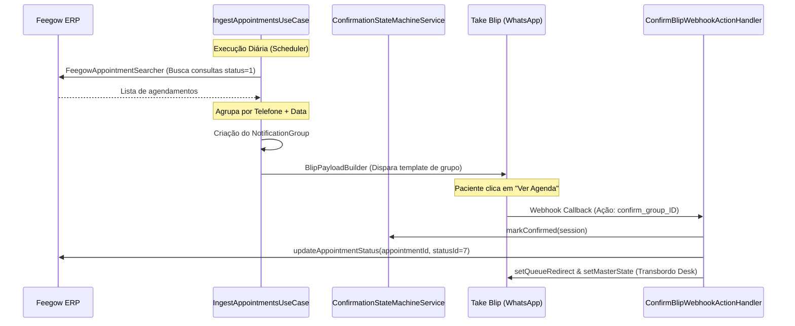

# Manual de Integrações — Inovare TI

Este documento detalha o fluxo de dados, a arquitetura e as regras de negócio das integrações da plataforma com os sistemas externos Feegow ERP, Take Blip (WhatsApp) e Conta Azul V2 (Financeiro), além do bot de suporte e alertas do Discord.

---

## 1. Motor de Agendamentos e Mensageria (Feegow ERP + Take Blip)

A sincronização de consultas e a esteira de confirmação automática integram o Feegow ERP ao WhatsApp (via Take Blip).



### 1.1 Ingestão e Busca de Agendamentos (`FeegowAppointmentSearcher`)
A rotina é orquestrada pelo caso de uso `IngestAppointmentsUseCase` e consome a API do Feegow por meio do `AppointmentExternalPort`.
* **Filtro de Procedimentos Elegíveis:** O ID do procedimento de cada consulta é comparado com os valores configurados na propriedade `app.appointment.eligible-procedure-ids`. Agendamentos não elegíveis são descartados.
* **Processamento no Modo de Teste:** Se `app.appointment-motor.test-mode=true`, a busca é delegada ao método `searchTestModeAppointments`. Este método lê os IDs dos médicos de teste definidos na propriedade `test-mode-doctor-ids` (ou `test-doctor-id`) e dispara consultas simultâneas no Feegow para `LocalDate.now()` e a data alvo (`targetDate`). Para otimizar o tempo de resposta, o paralelismo é implementado utilizando **Virtual Threads** por meio de `Executors.newVirtualThreadPerTaskExecutor()`.
* **Sanitização de Configuração:** Caso o valor de `test-mode-doctor-ids` contenha a sintaxe de placeholder cru do Spring (como `${...}`), a busca é abortada de forma segura para prevenir vazamentos de chaves ou erros de parser HTTP.

### 1.2 Formatação de Mensagens de Grupo (`BlipPayloadBuilder`)
Caso o paciente possua múltiplas consultas para o mesmo dia, os registros são reunidos em um `NotificationGroup` com um identificador de grupo (`groupId`).
* **Estrutura do Payload JSON LIME:** O componente `BlipPayloadBuilder` monta a chamada REST de template dinâmico enviada para o Blip.
* **Botão Interativo de Resposta Rápida (Quick Reply):** O payload do botão é configurado com a string `"ver_agenda_" + groupId.toString()`, apontando para a URI de destino `<telefone>@wa.gw.msging.net`.
* **Metadados:** A requisição carrega o campo `groupId` como metadados adicionais, garantindo a rastreabilidade do clique no webhook.

### 1.3 Processamento de Webhook (`ConfirmBlipWebhookActionHandler`)
Quando o paciente interage com o botão de confirmação, o Blip envia um evento para o webhook da aplicação.
* **Captura da Ação:** A classe `ConfirmBlipWebhookActionHandler` atua na confirmação de consultas, interceptando ações com o prefixo `confirm_group_`.
* **Resolução de Sessões:** A partir do `groupId` contido na ação, o handler recupera todos os registros de sessões do grupo através de `NotificationGroup` e de sessões ativas do mesmo telefone cadastrado no banco local (`activeContactSessions`).
* **Máquina de Estados de Confirmação:** O método `ConfirmationStateMachineService.markConfirmed` é chamado para atualizar o status das sessões para `CONFIRMED`, registrando a data e hora de encerramento (`closedAt`).
* **Sincronização com o Feegow:** O handler invoca `AppointmentExternalPort.updateAppointmentStatus` para alterar o status da consulta no ERP parceiro para o ID configurado em `feegow-confirmed-status-id` (padrão `"7"`).
* **Roteamento Dinâmico para o Desk (Transbordo):**
  1. **Resolução de Fila:** O médico associado à consulta é consultado na tabela de mapeamento (`AppointmentDoctorMappingRepositoryPort`). A fila associada (`blipQueueId`) é carregada. Caso não haja mapeamento ou seja inválido, o padrão adotado é `"Recepção Central / Suporte"`.
  2. **Atualização do Contexto:** O serviço `BlipContextService.setQueueRedirect` limpa contextos antigos no Blip e define o nome sanitizado da fila de atendimento humano no caminho `/contexts/{identity}/attendanceQueueToRedirect`.
  3. **Master-State Redirect:** O redirecionamento de estado ativo do roteador Blip é feito via `setMasterState` enviando o comando LIME para `desk@msging.net` apontando para o bloco final de confirmação de sucesso (ID de bloco de sucesso extraído da propriedade `blip-blocks-confirm-success`, padrão `"644d54dd-aefd-478b-93eb-10081acdd387"`).

---

## 2. Conciliação Financeira (Conta Azul V2)

Integração com a API V2 da Conta Azul para o processamento de vendas recebidas e automação do despacho de recibos eletrônicos.

### 2.1 Fluxo de Autenticação OAuth2 e Proatividade (`ContaAzulTokenService`)
A comunicação com os endpoints protegidos da Conta Azul exige tokens portadores JWT válidos.
* **URL de Autorização:** O método `buildAuthorizationUrl` monta o endereço de consentimento utilizando `client_id`, `redirect_uri` e um código de estado (`state`) gerado aleatoriamente via UUID.
* **Troca do Authorization Code:** Ao receber o código temporário no endpoint `/callback`, o método `exchangeAuthorizationCode` faz a requisição POST para o token endpoint, salvando o `access_token` e `refresh_token` na tabela `contaazul_oauth_tokens`.
* **Bloqueio Concorrente de Renovação:** O método `getValidTokenFromDatabase` avalia se o token expira em menos de 5 minutos. Caso sim, adquire uma trava baseada em `ReentrantLock` (`tokenLock`), recarrega o token do banco para verificar se outra thread já o atualizou e, em caso negativo, realiza o refresh.
* **Provedor de Refresh Proativo:** Um agendamento periódico anotado com `@Scheduled(fixedDelay = 3_000_000L, initialDelay = 300_000L)` executa a renovação silenciosa do token em segundo plano.
* **Tratamento de BadRequest (invalid_grant):** Caso a Conta Azul retorne erro indicando token expirado ou revogado (`invalid_grant`), o serviço apaga todos os registros de tokens persistidos (`tokenRepository.deleteAll()`), invalidando a integração e forçando o operador a realizar o fluxo de re-autorização manual via painel.

### 2.2 Processamento de Recibos e Proteções Técnicas
O serviço `ContaAzulReceiptProcessor` gerencia o lote de baixas quitadas (`ACQUITTED`) no ERP.
* **Rate Limiting no Endpoints Administrativos:** O endpoint de `/force-refresh` é protegido pelo `RedisRateLimiter` através do método `tryAcquire`. O rate limit aplica uma janela de **1 minuto** com o limite máximo de **3 requisições** por chave combinada de usuário + IP de origem (`contaazul:force_refresh:<who>:<ip>`). Caso o Redis esteja inoperante, um fallback baseado em `ConcurrentHashMap` aplica a mesma proteção de janela em memória. Requisições excedentes retornam o status HTTP `429 Too Many Requests`.
* **Algoritmo de Pacing (Throttling):** Para respeitar o rate-limit oficial do Conta Azul, o processor faz uma pausa controlada de **350 milissegundos** a cada iteração de venda no loop, usando `LockSupport.parkNanos(350_000_000L)`.
* **Idempotência Concorrente:** O processamento concorrente de baixas de faturamento é mitigado por meio do `ReceiptConcurrencyHandler`. Ele tenta adquirir uma trava lógica em nível de thread baseada no `baixaId` antes de iniciar a conciliação. A liberação ocorre em bloco `finally`.
* **Emissão Interna de Fallback (OpenPDF):** Se o download do recibo oficial falhar ou a API da Conta Azul retornar `NoReceiptAvailableException`, entra em ação o `InternalReceiptEmissionService`. Este serviço compila os dados da transação do banco local e gera um PDF de recibo interno substituto, evitando o travamento do despacho de e-mails.
* **Tratamento de Plano Inelegível:** Respostas HTTP 403 contendo as strings `"END_TRIAL"` ou `"NAO ESTA ELEGIVEL"` no corpo JSON da Conta Azul indicam que o plano do cliente está bloqueado. O sistema intercepta essa exceção e silencia o alerta, suspendendo temporariamente os jobs de busca para não inundar os logs com exceptions.

---

## 3. Monitoramento de Incidentes e Suporte (Discord API + Bot JDA 5)

Roteamento de alertas da Clínica Inovare no Discord, além de botões e comandos para atuação direta nos chamados.

```
                  ┌────────────────────────────────────────┐
                  │          Criar chamado / Evento        │
                  └───────────────────┬────────────────────┘
                                      │
                                      ▼
                      ┌───────────────────────────────┐
                      │    DiscordWebhookService      │
                      └───────────────┬───────────────┘
                                      ├───────────────────────────────┐
                     Se atribuído     │              Se não atribuído │
                                      ▼                               ▼
                      ┌───────────────────────────────┐   ┌───────────────────────────────┐
                      │ DM ao Técnico Responsável     │   │ DM a todos Admins / Técnicos  │
                      └───────────────┬───────────────┘   └───────────────┬───────────────┘
                                      │                               │
                                      └───────────────┬───────────────┘
                                                      ▼
                                      ┌───────────────────────────────┐
                                      │   Despacho Webhook + Embed    │
                                      │       Canal Operacional       │
                                      └───────────────┬───────────────┘
                                                      │ (JDA Ativo)
                                                      ▼
                                      ┌───────────────────────────────┐
                                      │ JDA Bot: Mensagem Operacional │
                                      │  com Botões Assumir/Recusar   │
                                      └───────────────────────────────┘
```

### 3.1 Notificações e Roteamento de Alertas (`DiscordWebhookService`)
O envio de novos chamados e atualizações ao Discord segue regras específicas:
* **Roteamento de Destinatários:**
  * **Com Técnico Atribuído:** Notifica exclusivamente a conta do Discord configurada no cadastro do técnico responsável (`assignedTo.getDiscordUserId()`) caso o campo `receivesItNotifications` seja verdadeiro.
  * **Sem Técnico Atribuído:** Obtém todos os usuários com papel `ADMIN` ou `TECHNICIAN` que possuem alertas ativos e encaminha DMs individuais contendo os detalhes, excetuando o próprio criador do chamado.
* **Sanitização de LGPD:** Todos os textos de descrições expostos nas mensagens do Discord passam pelo `DiscordLgpdSanitizer.sanitize(...)` para ofuscar dados pessoais sensíveis de pacientes ou profissionais de saúde.
* **Envio para o Canal Operacional:** Além do envio de DMs, uma mensagem rica (Embed) é despachada para o canal operacional via Webhook (`discord.operational.webhook.url`).
* **Resiliência e Recuperação:** As chamadas de envio de webhooks e mensagens JDA possuem a anotação `@Retryable`, executando até 3 tentativas com atraso exponencial (atraso de 1000ms com multiplicador de 2.0). Em caso de erro persistente, o método `@Recover` grava um alerta `DISCORD_WEBHOOK_FAILURE` na tabela de logs de incidentes `system_alerts`.
* **Notificação JDA com Botões:** Se o JDA estiver ativo, envia uma mensagem especial contendo os botões interativos "✅ Assumir" e "❌ Recusar" usando a ActionRow criada pelo método helper `DiscordInteractionListener.criarBotoesDeAcao(ticketId)`.

### 3.2 Comandos e Ações Interativas do Bot (`DiscordInteractionListener`)
A classe estende o `ListenerAdapter` da biblioteca JDA 5 para capturar cliques e slash commands executados na interface do Discord.
* **Comando `/ti status`:** Comando administrativo que exibe o resumo técnico de infraestrutura do sistema. O bot avalia se o ID do Discord do usuário que digitou o comando está contido na lista configurada em `discord.bot.admin-ids` e na tabela de técnicos do sistema. Caso validado, apresenta o embed rico gerado por `DiscordInfraStatusService`.
* **Comando `/solicitar`:** Comando interativo para requisição de insumos do estoque. O método `onCommandAutoCompleteInteraction` provê autocompletes em tempo real para busca de itens cadastrados no inventário. O comando cria um ticket de chamado associado ao solicitante.
* **Interação com os Botões de Ação:**
  * **Aceitar Chamado (`ticket_accept:<id>`):** Aciona o método `discordCommandService.assumirChamado`. O sistema associa o chamado ao técnico correspondente no banco. Se o fluxo completar com sucesso, edita a mensagem no Discord desabilitando os botões interativos e inclui o rodapé indicando qual técnico assumiu.
  * **Recusar Chamado (`ticket_reject:<id>`):** Aciona `discordCommandService.recusarChamado` liberando o chamado para os demais técnicos e desabilitando as ações.
* **Virtual Threads Executor:** Todas as ações pesadas executadas nos comandos ou botões são despachadas para o executor assíncrono `discordExecutor` (Virtual Threads). Isso evita o travamento e a perda de conexões do JDA com os servidores do Discord.
