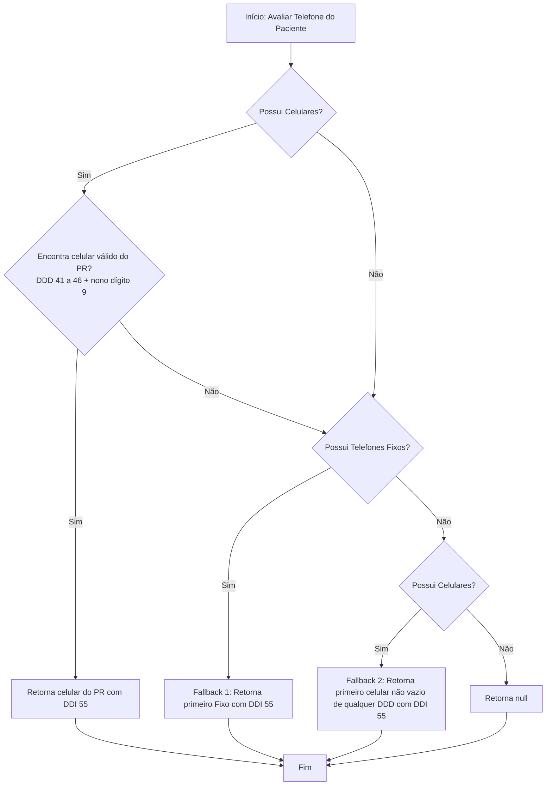

# Manual de Integrações — Inovare TI

Este documento detalha a arquitetura técnica, classes relevantes, configurações e regras de negócio que governam a comunicação da plataforma Inovare TI com parceiros e sistemas externos.

---

## 🏥 Feegow ERP (Integração de Consultas e Cadastro)

A integração com a Feegow centraliza a busca incremental de consultas para notificação e sincronização de dados de cadastro clínico.

### 1. Filtro Estrito de Procedimentos Elegíveis
Para evitar o envio de notificações sobre exames de rotina ou procedimentos não cobertos pelas políticas de relacionamento da clínica, a ingestão executa um filtro estrito:
* A propriedade `app.appointment.eligible-procedure-ids` (ou variável de ambiente `ELIGIBLE_PROCEDURE_IDS`) carrega uma lista de IDs separados por vírgula.
* No início do processamento do lote em [IngestAppointmentsUseCase](file:///C:/Projeto/Inovare-TI/api/src/main/java/br/dev/ctrls/inovareti/modules/appointment/application/usecase/IngestAppointmentsUseCase.java), o sistema valida o ID do procedimento de cada agendamento recebido contra esta lista configurada. Caso o ID não esteja mapeado, o agendamento é imediatamente descartado com logs de auditoria detalhados.

### 2. Estratégia de Fallback em Cascata de Telefone do Paciente
Devido à ausência de padronização nos registros telefônicos inseridos no ERP, o adapter de busca de dados do paciente [FeegowPatientAdapter](file:///C:/Projeto/Inovare-TI/api/src/main/java/br/dev/ctrls/inovareti/modules/appointment/infrastructure/adapter/output/feegow/FeegowPatientAdapter.java) implementa uma rotina inteligente de fallback em cascata para extrair e normalizar o melhor telefone de contato no método `resolvePreferredPhone`:

* **Prioridade Máxima (Celular do PR)**: Varre o array de celulares (`patientDetails.getCelulares()`). Tenta localizar um celular que corresponda às regras locais do Paraná (PR), verificadas no método `isPrCellPhone`: remove caracteres especiais (`cleanPhoneString`) e valida se o número limpo possui 11 dígitos iniciando com os DDDs **419, 429, 439, 449, 459 ou 469**. Se encontrado, normaliza com o DDI `55` via `formatWithCountryCode` e o retorna.
* **Fallback 1 (Telefone Fixo)**: Caso não encontre nenhum celular do Paraná, busca na lista de telefones fixos (`patientDetails.getTelefones()`). Se houver algum número preenchido, limpa a string, formata com o prefixo `55` e o retorna.
* **Fallback 2 (Celulares de outros estados)**: Se não houver telefone fixo cadastrado, varre novamente o array de celulares e retorna a primeira entrada não vazia encontrada (mesmo que pertença a outro estado e não passe no filtro de DDD do PR), formatada com o DDI `55`.
* **Descarte de Registro**: Se nenhuma das condições anteriores for atendida, o sistema retorna `null` e o agendamento é ignorado.

---

## 💬 Plataforma Blip e Meta Cloud API (Integração WhatsApp / Chatbot)

O Inovare TI conecta-se ao ecossistema do Blip para despacho de templates ativos de lembretes no WhatsApp e orquestração de transbordo humano para operadores clínicos.

As rotinas e comandos LIME são gerenciados em [BlipContextService](file:///C:/Projeto/Inovare-TI/api/src/main/java/br/dev/ctrls/inovareti/modules/appointment/application/service/BlipContextService.java) e chamados na API do Blip via [BlipLIMEClient](file:///C:/Projeto/Inovare-TI/api/src/main/java/br/dev/ctrls/inovareti/modules/appointment/infrastructure/adapter/output/client/BlipLIMEClient.java).

### 1. Engenharia de Transbordo e Roteamento Interno
O roteamento do usuário entre os canais de atendimento humano no Blip Desk é efetuado por variáveis de contexto e desvios dinâmicos de fluxo:
* **Fila de Redirecionamento (`attendanceQueueToRedirect`)**: O método `setQueueRedirect` realiza o direcionamento do paciente para filas de especialidades médicas específicas no Desk:
  1. **Limpeza Prévia Obrigatória**: Envia um comando `delete` para a URI `/contexts/{identity}/attendanceQueueToRedirect` no Blip. Isso remove resquícios de filas salvas em conversas anteriores, prevenindo desvios incorretos causados por contextos obsoletos.
  2. **Sanitização de String (`cleanQueueName`)**: Remove marcas invisíveis de leitura esquerda-para-direita (`\u200E`), referências a strings `"null"` e formata múltiplos espaços em branco.
  3. **Validação de Segurança e Fallback**: Se o nome limpo da fila for vazio ou inválido, define a fila como `"Recepção Central / Suporte"`. O sistema emite logs de alerta preventivos caso detecte que o nome da fila não possui a estrutura `" - "` esperada pelo Desk (evitando perdas de chamados por nomes incompletos).
  4. **Persistência do Contexto**: Realiza um comando `set` gravando o nome final da fila na URI `/contexts/{identity}/attendanceQueueToRedirect` como `text/plain`.

### 2. Controle de Estados do Roteador (Master-States)
Para posicionar o usuário no bloco ou bot correto da Take Blip de forma ativa e sem causar disputas com o chatbot de triagem:
* **Master-State do Roteador principal (`setMasterState`)**: Modifica o estado do usuário no roteador. Combina o ID do bloco destino (`stateId`) e o ID do bot destino (`flowId`), codifica o valor combinado em formato URL (`URLEncoder.encode`) e grava na URI `/contexts/{identity}/{encodedState}` definindo o bot alvo como recurso (`resource`).
* **Builder Master-State do Subbot (`setBuilderMasterState`)**: Atualiza o estado direto no chatbot Builder subordinado. Para isso, calcula o endereço do túnel de comunicação do subbot (`{cleanPhone}.{subbotLocalPart}@tunnel.msging.net`) e define o ID do bloco na URI `/contexts/{tunnelIdentity}/master-state` como recurso.
* **Aplicação na Ingestão**: Durante a ingestão de grupos no [IngestAppointmentsUseCase](file:///C:/Projeto/Inovare-TI/api/src/main/java/br/dev/ctrls/inovareti/modules/appointment/application/usecase/IngestAppointmentsUseCase.java), o sistema chama ambos os métodos em background (fire-and-forget) direcionando o paciente para o bloco `"PrepararAtendimento"`, o que garante que assim que o paciente interagir com a notificação, seu atendimento iniciará imediatamente no bloco correto de confirmações estruturadas.

---

## 💙 Conta Azul V2 (Conciliação Financeira e Recibos)

A plataforma integra-se de forma nativa com a API Conta Azul V2 para a leitura de faturamentos de pacientes, geração de relatórios de auditoria e envio automático de recibos oficiais aos clientes após a confirmação do pagamento.

### 1. Processamento e Automação de Recibos
* **Automação Incremental (`processAcquittedSales`)**: Em execução agendada periódica (ou sob demanda), o serviço [ContaAzulReceiptProcessor](file:///C:/Projeto/Inovare-TI/api/src/main/java/br/dev/ctrls/inovareti/modules/finance/application/service/ContaAzulReceiptProcessor.java) busca vendas com status `ACQUITTED` (Quitadas) via `contaAzulClient.fetchAcquittedSales` em um período específico, efetuando o processamento do recibo individual.
* **Pacing e Proteção Contra Rate Limits**: Para mitigar estouros de limite de requisições na API do Conta Azul, o método `applyThrottle()` em [ContaAzulReceiptProcessor](file:///C:/Projeto/Inovare-TI/api/src/main/java/br/dev/ctrls/inovareti/modules/finance/application/service/ContaAzulReceiptProcessor.java) induz uma pausa temporal controlada e não-bloqueante de **350ms** usando `LockSupport.parkNanos(350_000_000L)` a cada venda iterada no loop de execução.
* **Bloqueio Concorrente de Baixas**: Para impedir que execuções concorrentes processem e enviem recibos da mesma baixa em paralelo, o processador utiliza o [ReceiptConcurrencyHandler](file:///C:/Projeto/Inovare-TI/api/src/main/java/br/dev/ctrls/inovareti/modules/finance/infrastructure/adapter/output/ReceiptConcurrencyHandler.java) com trava baseada no `baixaId`. O sistema verifica se o ID já foi processado e tenta adquirir a trava. O bloqueio é obrigatoriamente liberado no escopo de um bloco `finally`.
* **Mapeamento de Médicos (`DoctorEmailMapping`)**: O validador resolve a qual profissional a transação pertence para determinar a conta de e-mail de remetente configurada no sistema de mensageria, personalizando os comunicados enviados ao cliente.

### 2. Conciliação Manual e Backfill Operacional
Geridos pelas rotinas do serviço [FinanceiroOperationsService](file:///C:/Projeto/Inovare-TI/api/src/main/java/br/dev/ctrls/inovareti/modules/finance/application/service/FinanceiroOperationsService.java):
* **Conciliação por ID (`conciliarParcelaPorId`)**: Endpoint de processamento manual para conciliar parcelas individuais. Verifica duplicidades, obtém os dados da parcela no Conta Azul, faz o download do recibo oficial e despacha o e-mail via `receiptDispatcher`. Em caso de erro 404 (recibo indisponível), trata o erro graciosamente despachando o e-mail com hash fictício e sem anexo (`dispatchReceiptWithoutPdf`).
* **Backfill Histórico dos Últimos 30 Dias (`executarBackfillUltimos30Dias`)**: Permite rodar uma carga histórica retroativa de parcelas quitadas. A busca é dividida em pequenas janelas temporais (`WINDOW_DAYS`) e paginada. O sistema verifica vínculos cadastrados (`FinancialLink`), cria registros históricos de recibo (`ProcessedReceipt`), e realiza pausas entre janelas temporais via `LockSupport.parkNanos` para se adequar ao limite de concorrência.

### 3. Mecanismos de Contingência e Blindagem de Planos
* **Geração Interna de Recibo (Fallback de PDF)**: Caso o recibo oficial de faturamento na Conta Azul não exista ou falhe o download (exemplo: erro `NoReceiptAvailableException` lançado pela API do parceiro), a aplicação aciona o fallback via [InternalReceiptEmissionService](file:///C:/Projeto/Inovare-TI/api/src/main/java/br/dev/ctrls/inovareti/modules/finance/application/service/InternalReceiptEmissionService.java). Esse serviço gera de forma autônoma um PDF de recibo interno com base nas informações e metadados transacionados, viabilizando o despacho do e-mail ao paciente mesmo em cenários de indisponibilidade no ERP.
* **Tratamento de Plano Inelegível / Suspenso**: Respostas de erro HTTP `403 Forbidden` vindas do parceiro que contêm termos como `"END_TRIAL"` ou `"NAO ESTA ELEGIVEL"` no corpo do JSON são identificadas e tratadas de forma silenciosa e graciosa (`isPlanIneligibleResponse`). O sistema suspende temporariamente os jobs de polling sem disparar alertas críticos ou exceptions que gerem instabilidade no servidor.
