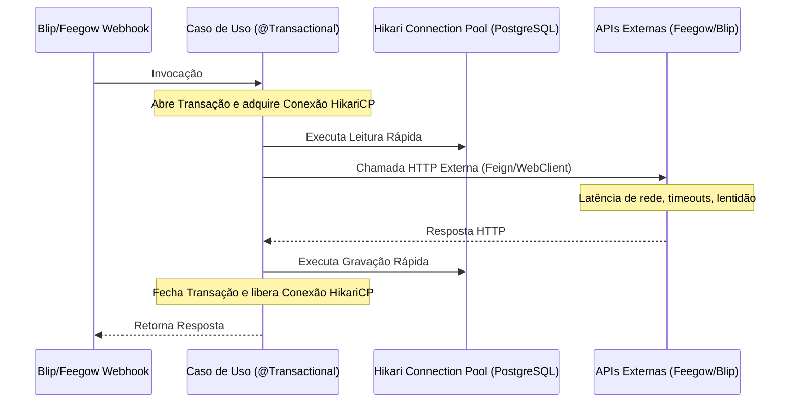
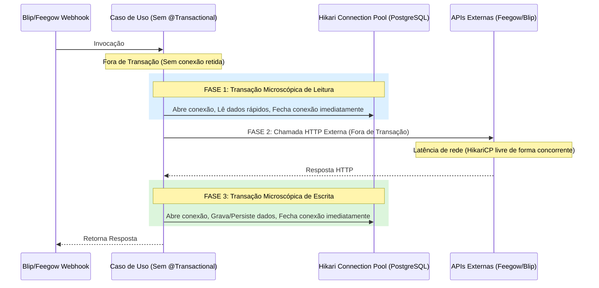

# Relatório de Implementação - Refatoração HikariCP e Virtual Threads

Este documento detalha as modificações executadas no projeto **Inovare-TI** para mitigar o esgotamento do pool de conexões **HikariCP** e otimizar a concorrência por meio de **Virtual Threads** (Java 21) no ecossistema Spring Boot 3.x.

---

## 1. O Problema Identificado

Anteriormente, os principais Casos de Uso que orquestravam as integrações de agendamento e webhooks possuíam a anotação `@Transactional` cobrindo todo o seu escopo de execução. Esse design criava um gargalo de concorrência crítico:



Como resultado, conexões do pool de banco de dados permaneciam ativas e retidas enquanto a aplicação aguardava respostas de rede de serviços de terceiros (Feegow e Blip). Sob concorrência, o pool HikariCP se esgotava rapidamente, causando erros de timeout e indisponibilidade.

---

## 2. Solução Implementada

### A. Ativação e Configuração de Virtual Threads (Java 21)

1. **Habilitação das Virtual Threads**:
   Adicionado a propriedade de configuração nativa em `application.properties`:
   ```properties
   spring.threads.virtual.enabled=true
   ```
2. **Nova Classe de Configuração Assíncrona**:
   Criado o arquivo [AsyncConfiguration.java](file:///c:/Projeto/Inovare-TI/api/src/main/java/br/dev/ctrls/inovareti/config/AsyncConfiguration.java) anotado com `@EnableAsync` que reconfigura o bean `applicationTaskExecutor` do Spring.
   ```java
   @Bean(name = TaskExecutionAutoConfiguration.APPLICATION_TASK_EXECUTOR_BEAN_NAME)
   @Primary
   public AsyncTaskExecutor applicationTaskExecutor() {
       return new TaskExecutorAdapter(Executors.newVirtualThreadPerTaskExecutor());
   }
   ```
   *Nota: O arquivo obsoleto `AsyncConfig.java` foi removido com sucesso para evitar redundâncias e colisões de definições.*

---

### B. Refatoração de Fronteiras Transacionais (Faseamento e Micro-Transações)

Removemos a anotação `@Transactional` de nível de classe/método orquestrador e introduzimos o padrão de isolamento microscópico via `TransactionTemplate`. As chamadas de rede HTTP externas foram 100% isoladas de transações ativas no banco de dados.



#### Alterações por Arquivo:

1. **[IngestAppointmentsUseCase.java](file:///c:/Projeto/Inovare-TI/api/src/main/java/br/dev/ctrls/inovareti/domain/appointment/usecase/IngestAppointmentsUseCase.java)**:
   - Remoção do `@Transactional` do método `execute()`.
   - Criação da `DbLookupResult` para agrupar leituras rápidas do banco em um único bloco transacional sob `transactionTemplate.execute(...)`.
   - Condução das requisições HTTP (`feegowClient.getPatientDetails` e `feegowClient.getProfessionalName`) em paralelo usando `Executors.newVirtualThreadPerTaskExecutor()`, totalmente desvinculadas de conexões de banco de dados.
   - Envelopamento do salvamento do agendamento em transação de escrita dedicada.

2. **[SendAppointmentTemplateUseCase.java](file:///c:/Projeto/Inovare-TI/api/src/main/java/br/dev/ctrls/inovareti/domain/appointment/usecase/SendAppointmentTemplateUseCase.java)**:
   - Remoção do `@Transactional` dos métodos principais de disparo.
   - Micro-transações dedicadas para ler configurações no banco e sessões.
   - Execução do envio de templates de mensagens do Blip e travamento preventivo do bot fora de transação ativa.
   - Atualização do método `saveWithRetry` para que seu retry e o bloqueio pessimista (`findByIdLocked`) rodem encapsulados estritamente em seu próprio bloco de transação.

3. **[HandleBlipWebhookUseCase.java](file:///c:/Projeto/Inovare-TI/api/src/main/java/br/dev/ctrls/inovareti/domain/appointment/usecase/HandleBlipWebhookUseCase.java)**:
   - Remoção do `@Transactional` do método de entrada de webhooks.
   - Fases de leitura de sessões e mapeamentos isoladas no banco.
   - Chamadas REST com APIs externas Feegow (`updateAppointmentStatus`, `patientInfo`) e Blip (`processAppointmentPush`) isoladas de transações abertas.
   - Consolidação de uma única transação microscópica de gravação para persistir as alterações da sessão de agendamento de forma robusta e livre de vazamento de estado.

---

## 3. Validação do Build e Compilação

Executamos o plano de compilação utilizando Maven sob o ecossistema multi-módulo do projeto em `c:\Projeto\Inovare-TI\api`:

```powershell
mvn clean compile
```

O build foi concluído com absoluto **SUCESSO**:
* **Total Time**: 11.851s
* **Compilation Status**: BUILD SUCCESS
* **Warnings/Errors**: 0 erros de compilação ou inconsistências de tipo no código adaptado.

---

## 4. Atualização Frontend - Categoria/SLA e Colaboradores Afetados (27/05/2026)

### A. Tipagens e Integração com API
- `Ticket` agora inclui `additionalUserIds` para refletir colaboradores afetados retornados pela API.
- Adicionados endpoints no service de tickets para:
    - `PATCH /tickets/{id}/category/{categoryId}` (troca de categoria + recálculo de SLA).
    - `POST /tickets/{id}/additional-users/{userId}` (vincular colaborador adicional).

### B. Transparência Controlada no Detalhe do Chamado
- **Admin/Tech**: dropdown de categoria ativo para troca de SLA com atualização imediata na UI.
- **Usuários comuns**: categoria exibida como texto estático; SLA continua visível.
- Seção **Colaboradores Afetados** visível para todos com chips; botão `+` apenas para Admin/Tech.

### C. Validação de Build

Frontend:
```powershell
cd front
npm run build
```
Resultado: build finalizado com sucesso via Vite + TypeScript.

Backend:
```powershell
cd api
mvn clean compile
```
Resultado: BUILD SUCCESS.

---

## 5. Refinamento do Seletor de Colaboradores Afetados (27/05/2026)

### A. Busca Preditiva e Filtro por Setor
- O modal de vinculo agora possui campo de busca por nome/e-mail.
- Inclusao de filtro por setor e agrupamento visual por setor na lista.
- Opcoes exibem o setor junto ao nome do colaborador para facilitar a selecao.

### B. Validação de Build

Frontend:
```powershell
cd front
npm run build
```
Resultado: build finalizado com sucesso via Vite + TypeScript.

---

## 6. Fase 1 - Segurança, Performance e Bugfixes

### A. Analytics do Dashboard no Backend
- `GetDashboardAnalyticsUseCase.java` deixou de carregar todos os chamados em memória para montar os gráficos.
- As contagens por categoria, setor, solicitante e mês passaram a vir de consultas agregadas no `TicketRepository`.
- O campo `totalClosedTickets` passou a ser calculado a partir de `closedAt IS NOT NULL`, eliminando o valor fixo `0`.
- O contrato `DashboardAnalyticsDTO` ganhou a série `ticketsByMonth` para consumo direto pelo frontend.

### B. Blindagem de Logs de Erro
- `GlobalExceptionHandler.java` passou a sanitizar e truncar corpos de resposta de APIs externas antes de registrar logs.
- Os logs agora registram apenas metadados estruturados como status HTTP, URL, request id e tamanho do payload, reduzindo risco de vazamento de tokens e PII.

### C. Frontend do Dashboard
- O componente `ChartsBar.tsx` passou a renderizar a série mensal agregada retornada pelo backend.
- A tela de dashboard deixou de usar `getTickets()` para montar o gráfico de volume mensal e passou a consumir `ticketsByMonth`.
- O fetch de tickets brutos foi mantido apenas para as áreas do dashboard que realmente dependem da lista individual do usuário.

### D. Validação
- Backend:
```powershell
cd api
mvn clean compile
```
- Frontend:
```powershell
cd front
npm run build
```
- Ambos os builds foram validados com sucesso após a refatoração.

---

## 7. Fase 2 - Evolução Visual do ITSM v17

### A. Novos Indicadores do Dashboard
- O backend passou a expor `ticketsBySectorAndPriority`, agregando chamados por setor e prioridade consolidada.
- As prioridades técnicas `HIGH` e `URGENT` foram exibidas como `Alta` no painel, enquanto `NORMAL` virou `Média` e `LOW` virou `Baixa`.
- O indicador `slaBreachesByCategory` passou a contar chamados finalizados cujo `closedAt` ultrapassou `slaDeadline`, usando `RESOLVED` e `CLOSED` como filtro de encerramento no SQL nativo.

### B. Frontend com Recharts
- Criado o gráfico empilhado de setor x prioridade em [ChartsBarStacked.tsx](front/src/components/ChartsBarStacked.tsx).
- Criado o gráfico horizontal de estouros de SLA por categoria em [SlaBreachesBar.tsx](front/src/components/SlaBreachesBar.tsx).
- O dashboard passou a renderizar os dois gráficos lado a lado em layout responsivo, consumindo diretamente os arrays do `DashboardAnalyticsDTO`.

### C. Contrato e Validação
- [finance.types.ts](front/src/types/models/finance.types.ts) foi expandido para refletir as novas séries agregadas.
- A compilação do backend e o build do frontend foram revalidados após a expansão dos indicadores.

---

## 8. Fase 3 - Inteligência Contextual, Macros e Automações Críticas (V19)

### A. Evolução do Banco de Dados (Flyway Migration V19)
- Criado o arquivo [V19__ticket_tags_and_critical_assets.sql](file:///C:/Projeto/Inovare-TI/api/src/main/resources/db/migration/V19__ticket_tags_and_critical_assets.sql) que:
  - Limpou a antiga tabela de tags de texto legado com `DROP TABLE IF EXISTS ticket_tags CASCADE;`.
  - Criou a tabela mestre `ticket_tags` (`id uuid`, `name` unique, `color`, `active`, `default_resolution` macro text).
  - Criou a tabela de junção `ticket_tag_relations` ligando chamados e tags em formato Many-to-Many.
  - Adicionou a flag `is_critical` (default false) na tabela `assets` (CMDB) e o relacionamento `asset_id` em `tickets`.

### B. JPA, CRUD de Tags e Filtros no Dashboard (Backend)
- Mapeada a entidade [TicketTag.java](file:///C:/Projeto/Inovare-TI/api/src/main/java/br/dev/ctrls/inovareti/domain/ticket/TicketTag.java) e seu repositório [TicketTagRepository.java](file:///C:/Projeto/Inovare-TI/api/src/main/java/br/dev/ctrls/inovareti/domain/ticket/TicketTagRepository.java).
- Atualizado o relacionamento Many-to-Many em [Ticket.java](file:///C:/Projeto/Inovare-TI/api/src/main/java/br/dev/ctrls/inovareti/domain/ticket/Ticket.java) e a flag em [Asset.java](file:///C:/Projeto/Inovare-TI/api/src/main/java/br/dev/ctrls/inovareti/domain/asset/Asset.java).
- Criado o [TicketTagController.java](file:///C:/Projeto/Inovare-TI/api/src/main/java/br/dev/ctrls/inovareti/domain/ticket/TicketTagController.java) expondo o CRUD completo `/api/ticket-tags` e o soft-delete via PATCH `/toggle-active`.
- Adicionado suporte a parâmetros de filtros por múltiplos IDs de tags em `GET /api/tickets` e no `ListAllTicketsUseCase.java`.
- Atualizado o [TicketResponseDTO.java](file:///C:/Projeto/Inovare-TI/api/src/main/java/br/dev/ctrls/inovareti/domain/ticket/dto/TicketResponseDTO.java) para expor as novas informações ricas de tags, `assetId`, `assetName` e `isAssetCritical`.

### C. Chamados Similares, Auto-Tagging e SLA de Parada Crítica
- Criado o endpoint `GET /api/tickets/{id}/similar` buscando de forma otimizada chamados já resolvidos que compartilhem tags com o atual, agindo como uma base de conhecimento contextual.
- No `CreateTicketUseCase.java`, se o ativo associado for crítico (`is_critical = true`), o sistema força automaticamente a prioridade para `URGENT`, encurta o SLA para **exatamente 1 hora**, injeta a tag especial `#🚨ParadaCrítica` e envia uma DM privada em formato rico (Embed vermelho) via Discord (JDA) para o técnico responsável.
- Refatorado o `TicketTagExtractor.java` para buscar dinamicamente as tags ativas do banco e injetá-las de modo case-insensitive.
- Atualizados o `DiscordTicketService.java` e `DiscordEventListener.java` para aceitar opcionalmente o parâmetro `patrimonio` ou detectá-lo por expressões regulares (`INV-\d{4}-\d+`) nos comandos `/chamado`.

### D. Scheduled Weekly Digest (Discord Scheduler)
- Criado o [WeeklyDigestScheduler.java](file:///C:/Projeto/Inovare-TI/api/src/main/java/br/dev/ctrls/inovareti/domain/notification/discord/bot/WeeklyDigestScheduler.java) rodando toda sexta-feira às 17h via cron `@Scheduled`.
- Computa agregados semanais via consultas nativas (`EntityManager`): total resolvido, % de conformidade de SLA, tag mais ativa (gargalo) e setor mais afetado. Envia um Embed executivo premium no canal de TI (com fallback para webhook corporativo).

### E. Módulos Frontend (React / TypeScript)
- **Painel de Tags**: Criado o componente [TagsSection.tsx](file:///C:/Projeto/Inovare-TI/front/src/pages/Settings/TagsSection.tsx) permitindo criar, editar, alternar ativação lógica (soft-delete) e definir o texto da macro padrão, utilizando o seletor nativo `<input type="color" />`.
- **Filtro Avançado**: Integrado um dropdown customizado de Multi-Select com chips responsivos na barra superior de filtros de [Tickets/index.tsx](file:///C:/Projeto/Inovare-TI/front/src/pages/Tickets/index.tsx).
- **Base de Conhecimento e Macros**:
  - Em [TicketSidebar.tsx](file:///C:/Projeto/Inovare-TI/front/src/pages/TicketDetails/TicketSidebar.tsx), se o chamado estiver em andamento (`IN_PROGRESS`), exibe um acordeão contendo os chamados similares resolvidos com suas respectivas soluções.
  - Se alguma tag do chamado atual possuir uma macro de resolução configurada, renderiza o botão premium "🚀 Aplicar Solução Padrão". Ao clicar, preenche automaticamente a nota de resolução no modal [ResolveTicketModal.tsx](file:///C:/Projeto/Inovare-TI/front/src/pages/TicketDetails/ResolveTicketModal.tsx) e abre-o de forma imediata.
- **Visualização Estilizada**: Atualizado o [TicketHeader.tsx](file:///C:/Projeto/Inovare-TI/front/src/pages/TicketDetails/TicketHeader.tsx) para renderizar os badges de tags com bordas e cores de fundo harmonizadas dinamicamente a partir dos códigos hexadecimais salvos no banco.

### F. Builds e Validações Finais
- **Backend Build**: `mvn clean compile` executado e bem-sucedido (**BUILD SUCCESS**).
- **Frontend Build**: `npm run build` executado e empacotado sem qualquer erro ou aviso (**Vite Build Success**).

---

## 9. Ajuste de Infraestrutura do Discord (Isolamento de Concorrência & Observabilidade)

Para sanar as quedas silenciosas do bot de Discord causadas por **Carrier Thread Pinning** na execução das APIs internas do JDA com Virtual Threads, isolamos a concorrência e implementamos listeners nativos de integridade de gateway.

### A. Isolamento de Concorrência no `DiscordBotConfig.java`
- Configurado o builder do JDA explicitamente com `.setAutoReconnect(true)` para garantir resiliência automática contra oscilações de rede.
- Mantivemos o executor de Virtual Threads (`discordExecutor`) isolado das threads internas de infraestrutura do JDA (WebSocket e Heartbeat do gateway). O JDA agora gerencia autonomamente seus pools nativos padronizados (`gatewayPool`, `rateLimitPool` e `callbackPool`), evitando o gargalo de bloqueio síncrono profundo das Virtual Threads nas chamadas do WebSocket.
- O `discordExecutor` (Virtual Threads) continua a ser injetado estritamente nos listeners de eventos de negócios e UseCases (`DiscordEventListener` e `DiscordInteractionListener`) de forma assíncrona e desacoplada, preservando a performance sem afetar o ciclo de vida de conexão do JDA.

### B. Listeners de Saúde de Conexão no `DiscordEventListener.java`
Sobrescrevemos os métodos nativos de monitoramento de sessão do JDA para garantir total observabilidade sobre o ciclo de vida do bot:
- **`onDisconnect` (DisconnectEvent)**: Loga como `WARN` a queda de conexão com o Gateway do Discord, incluindo data/hora, se o encerramento partiu do servidor e o código/motivo detalhado do fechamento do socket.
- **`onReconnected` (ReconnectedEvent)**: Loga como `INFO` o restabelecimento bem-sucedido do link de gateway e reativação do bot.
- **`onShutdown` (ShutdownEvent)**: Loga como `WARN` o momento e o motivo caso a instância do JDA seja encerrada ou destruída.

### C. Validação de Build e Compilação
- O build da API Spring Boot passa sem erros de sintaxe ou de linkagem (`mvn clean compile`), validando as assinaturas dos novos métodos e dependências.

---

## 10. Estabilização do Ciclo de Vida React - Prevenção de Loops e Erro HTTP 429

Para solucionar o problema de indisponibilidade decorrente de re-renderizações infinitas e consequentes erros de Rate Limit (HTTP 429) introduzidos pela Fase 3, otimizamos o gerenciamento de estado e dependências no frontend do chamado.

### A. Auditoria e Correção de Dependências de Arrays (TicketSidebar.tsx)
- **Memoização de Arrays Derivados:** Isolamos a geração das listas `availableUsers` e `filteredAvailableUsers` usando o hook `useMemo`. Anteriormente, a recriação dessas referências de array a cada ciclo de renderização acionava loops recorrentes em efeitos secundários como o validador de colaboradores vinculados.
- **Serialização de Chaves de Comparação:** Substituímos a dependência direta de objetos e coleções complexas no array do `useEffect` de filtragem por comparadores de strings primitivas imutáveis (`ticket.relatedTicketIds?.join(',')`). Isso impede disparos indevidos por mudanças de referência na memória.

### B. Cláusulas de Barreira e Guarda de Curto-Circuito
- Adicionamos uma barreira explícita no início da rotina de busca de chamados similares (`getSimilarTickets`): o efeito é abortado imediatamente caso o `ticket.id` não seja válido ou o status não seja `IN_PROGRESS`.
- **Memoização de Handlers:** Envelopamos os callbacks de eventos passados entre componentes (como `handleApplyMacro` e `handleSaveSolution` em `index.tsx`) com o hook `useCallback`, garantindo que referências idênticas sejam preservadas entre ciclos de desenho do React.

### C. Validação do Build do Frontend
- Executamos `npm run build` na pasta `front` e o empacotamento completo por meio do compilador TypeScript (`tsc`) e do `vite build` foi finalizado com absoluto **SUCESSO**.


