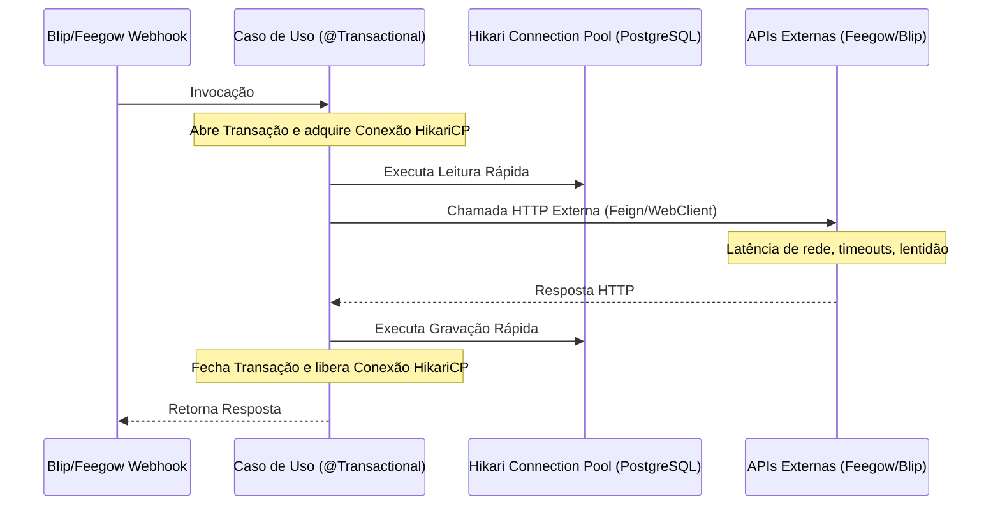
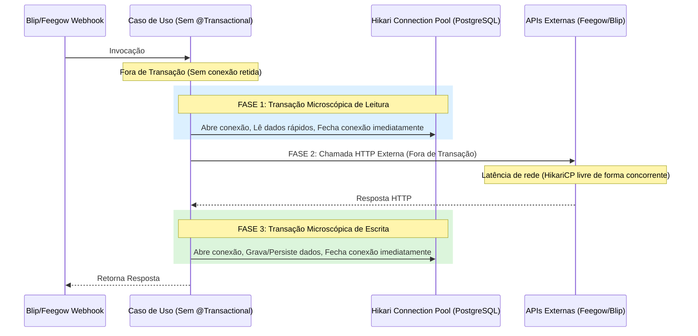

# Relatório de Implementação - Refatoração HikariCP e Virtual Threads

Este documento detalha as modificações executadas no projeto **Inovare-TI** para mitigar o esgotamento do pool de conexões **HikariCP** e otimizar a concorrência por meio de **Virtual Threads** (Java 21) no ecossistema Spring Boot 3.x.

---

## 1. O Problema Identificado

Anteriormente, os principais Casos de Uso que orquestravam as integrações de agendamento e webhooks possuíam a anotação `@Transactional` cobrindo todo o seu escopo de execução. Esse design criava um gargalo de concorrência crítico:



Como resultado, conexões do pool de banco de dados permaneciam ativas e retidas enquanto a aplicação aguardava respostas de rede de serviços de terceiros (Feegow e Blip). Sob concorrência, o pool HikariCP se esgotava rapidamente, causando erros de timeout e indisponibilidade.

---

## 2. Solução Implementada

### A. Ativação e Configuração de Virtual Threads (Java 21)

1. **Habilitação das Virtual Threads**:
   Adicionado a propriedade de configuração nativa em `application.properties`:
   ```properties
   spring.threads.virtual.enabled=true
   ```
2. **Nova Classe de Configuração Assíncrona**:
   Criado o arquivo [AsyncConfiguration.java](file:///c:/Projeto/Inovare-TI/api/src/main/java/br/dev/ctrls/inovareti/config/AsyncConfiguration.java) anotado com `@EnableAsync` que reconfigura o bean `applicationTaskExecutor` do Spring.
   ```java
   @Bean(name = TaskExecutionAutoConfiguration.APPLICATION_TASK_EXECUTOR_BEAN_NAME)
   @Primary
   public AsyncTaskExecutor applicationTaskExecutor() {
       return new TaskExecutorAdapter(Executors.newVirtualThreadPerTaskExecutor());
   }
   ```
   *Nota: O arquivo obsoleto `AsyncConfig.java` foi removido com sucesso para evitar redundâncias e colisões de definições.*

---

### B. Refatoração de Fronteiras Transacionais (Faseamento e Micro-Transações)

Removemos a anotação `@Transactional` de nível de classe/método orquestrador e introduzimos o padrão de isolamento microscópico via `TransactionTemplate`. As chamadas de rede HTTP externas foram 100% isoladas de transações ativas no banco de dados.



#### Alterações por Arquivo:

1. **[IngestAppointmentsUseCase.java](file:///c:/Projeto/Inovare-TI/api/src/main/java/br/dev/ctrls/inovareti/domain/appointment/usecase/IngestAppointmentsUseCase.java)**:
   - Remoção do `@Transactional` do método `execute()`.
   - Criação da `DbLookupResult` para agrupar leituras rápidas do banco em um único bloco transacional sob `transactionTemplate.execute(...)`.
   - Condução das requisições HTTP (`feegowClient.getPatientDetails` e `feegowClient.getProfessionalName`) em paralelo usando `Executors.newVirtualThreadPerTaskExecutor()`, totalmente desvinculadas de conexões de banco de dados.
   - Envelopamento do salvamento do agendamento em transação de escrita dedicada.

2. **[SendAppointmentTemplateUseCase.java](file:///c:/Projeto/Inovare-TI/api/src/main/java/br/dev/ctrls/inovareti/domain/appointment/usecase/SendAppointmentTemplateUseCase.java)**:
   - Remoção do `@Transactional` dos métodos principais de disparo.
   - Micro-transações dedicadas para ler configurações no banco e sessões.
   - Execução do envio de templates de mensagens do Blip e travamento preventivo do bot fora de transação ativa.
   - Atualização do método `saveWithRetry` para que seu retry e o bloqueio pessimista (`findByIdLocked`) rodem encapsulados estritamente em seu próprio bloco de transação.

3. **[HandleBlipWebhookUseCase.java](file:///c:/Projeto/Inovare-TI/api/src/main/java/br/dev/ctrls/inovareti/domain/appointment/usecase/HandleBlipWebhookUseCase.java)**:
   - Remoção do `@Transactional` do método de entrada de webhooks.
   - Fases de leitura de sessões e mapeamentos isoladas no banco.
   - Chamadas REST com APIs externas Feegow (`updateAppointmentStatus`, `patientInfo`) e Blip (`processAppointmentPush`) isoladas de transações abertas.
   - Consolidação de uma única transação microscópica de gravação para persistir as alterações da sessão de agendamento de forma robusta e livre de vazamento de estado.

---

## 3. Validação do Build e Compilação

Executamos o plano de compilação utilizando Maven sob o ecossistema multi-módulo do projeto em `c:\Projeto\Inovare-TI\api`:

```powershell
mvn clean compile
```

O build foi concluído com absoluto **SUCESSO**:
* **Total Time**: 11.851s
* **Compilation Status**: BUILD SUCCESS
* **Warnings/Errors**: 0 erros de compilação ou inconsistências de tipo no código adaptado.

---

## 4. Atualização Frontend - Categoria/SLA e Colaboradores Afetados (27/05/2026)

### A. Tipagens e Integração com API
- `Ticket` agora inclui `additionalUserIds` para refletir colaboradores afetados retornados pela API.
- Adicionados endpoints no service de tickets para:
    - `PATCH /tickets/{id}/category/{categoryId}` (troca de categoria + recálculo de SLA).
    - `POST /tickets/{id}/additional-users/{userId}` (vincular colaborador adicional).

### B. Transparência Controlada no Detalhe do Chamado
- **Admin/Tech**: dropdown de categoria ativo para troca de SLA com atualização imediata na UI.
- **Usuários comuns**: categoria exibida como texto estático; SLA continua visível.
- Seção **Colaboradores Afetados** visível para todos com chips; botão `+` apenas para Admin/Tech.

### C. Validação de Build

Frontend:
```powershell
cd front
npm run build
```
Resultado: build finalizado com sucesso via Vite + TypeScript.

Backend:
```powershell
cd api
mvn clean compile
```
Resultado: BUILD SUCCESS.

---

## 5. Refinamento do Seletor de Colaboradores Afetados (27/05/2026)

### A. Busca Preditiva e Filtro por Setor
- O modal de vinculo agora possui campo de busca por nome/e-mail.
- Inclusao de filtro por setor e agrupamento visual por setor na lista.
- Opcoes exibem o setor junto ao nome do colaborador para facilitar a selecao.

### B. Validação de Build

Frontend:
```powershell
cd front
npm run build
```
Resultado: build finalizado com sucesso via Vite + TypeScript.

---

## 6. Fase 1 - Segurança, Performance e Bugfixes

### A. Analytics do Dashboard no Backend
- `GetDashboardAnalyticsUseCase.java` deixou de carregar todos os chamados em memória para montar os gráficos.
- As contagens por categoria, setor, solicitante e mês passaram a vir de consultas agregadas no `TicketRepository`.
- O campo `totalClosedTickets` passou a ser calculado a partir de `closedAt IS NOT NULL`, eliminando o valor fixo `0`.
- O contrato `DashboardAnalyticsDTO` ganhou a série `ticketsByMonth` para consumo direto pelo frontend.

### B. Blindagem de Logs de Erro
- `GlobalExceptionHandler.java` passou a sanitizar e truncar corpos de resposta de APIs externas antes de registrar logs.
- Os logs agora registram apenas metadados estruturados como status HTTP, URL, request id e tamanho do payload, reduzindo risco de vazamento de tokens e PII.

### C. Frontend do Dashboard
- O componente `ChartsBar.tsx` passou a renderizar a série mensal agregada retornada pelo backend.
- A tela de dashboard deixou de usar `getTickets()` para montar o gráfico de volume mensal e passou a consumir `ticketsByMonth`.
- O fetch de tickets brutos foi mantido apenas para as áreas do dashboard que realmente dependem da lista individual do usuário.

### D. Validação
- Backend:
```powershell
cd api
mvn clean compile
```
- Frontend:
```powershell
cd front
npm run build
```
- Ambos os builds foram validados com sucesso após a refatoração.
